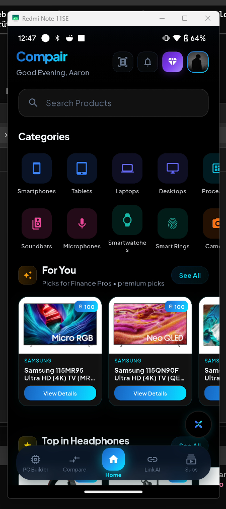
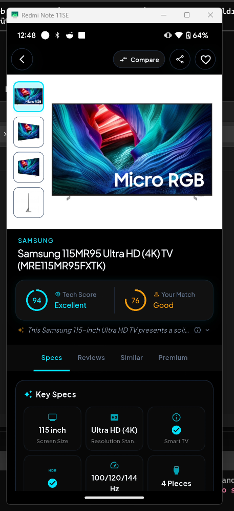
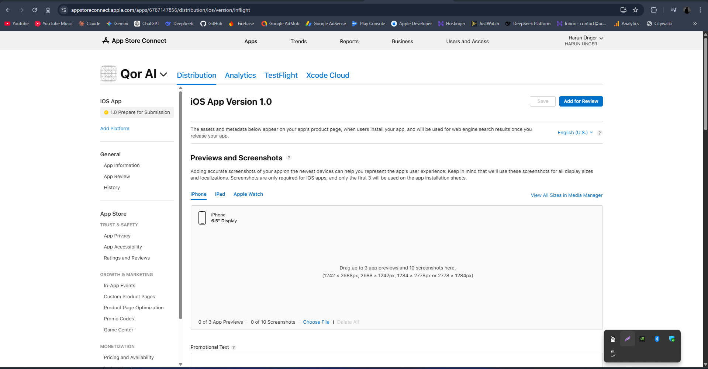

# Qor AI

<p align="center">
   
</p>

<p align="center">
   AI-powered decision engine for tech products and subscriptions.<br/>
   Flutter mobile app + PocketBase backend + Typesense search + DeepSeek/Gemini intelligence.
</p>

<p align="center">
   
   
   
</p>

## Overview

Qor AI is the current production-focused mobile app for personalized tech discovery, product comparison, subscription analysis, and AI-assisted buying decisions. The app is built primarily for Android and iOS with Flutter, uses Riverpod for state orchestration, GoRouter for app navigation, PocketBase for app data/auth/admin flows, Typesense for fast product search, DeepSeek for cost-efficient text intelligence, and Gemini for multimodal vision plus grounded web analysis.

The current mobile shell is built around five persistent product surfaces:

- PC Build
- Compare
- Home
- Link AI
- Subscriptions

Outside that shell, the app also includes product detail, AI chat, search, profile/settings, visual scanner, notifications, recent history, collections, behavior report, and premium/paywall flows.

## Current Product Experience

### 1. Personalized Home Feed

- Personalized landing feed with category rails, recommendation blocks, trending picks, and premium highlights.
- Match-oriented discovery driven by quiz/profile signals, browsing behavior, favorites, and category priorities.
- Fast-loading product cards with Q badges, tech scores, quick compare entry points, and AI shortcuts.

### 2. Product Detail Intelligence

- Large hero product presentation with gallery, compare shortcut, sharing, favorites, and AI actions.
- Tech Score, compatibility/match score, specs, similar products, reviews, and premium analysis tabs.
- Community review synthesis, pros/cons, pricing surfaces, and embedded YouTube review handling.
- AI-gated premium surfaces now share a single localized Q-limit experience.

### 3. Compare Flow

- Compare queue with product search, score chips, and add/remove actions.
- Side-by-side comparison results for specs, strengths, and fit-oriented recommendations.
- Link-based comparison support for external URLs and AI-assisted decision output.

### 4. Link AI

- Paste a product URL and let AI validate the page, identify the product, and enrich the result.
- Single-link analysis and multi-link comparison support.
- Quiz-assisted compatibility scoring layered on top of scraped metadata and model reasoning.

### 5. Subscription Intelligence

- Enter services like Netflix, Spotify, ChatGPT Plus, Disney+, Apple One, and similar subscriptions.
- AI resolves the entered services, builds a short personal quiz, and blends web/community signals into a final recommendation.
- Localized progress timeline, info cards, premium/Qor gating, and subscription history flows.
- Daily Q limit warnings now use the same premium purple language-safe experience instead of the previous red inline warning.

### 6. PC Builder AI

- Dedicated PC Builder landing, active build flow, and build history screens.
- Component-by-component system assembly with compatibility awareness and AI analysis.
- AI-generated upgrade suggestions and system diagnosis.
- PC Builder Q-limit messaging now also uses the shared localized premium limit copy.

### 7. Visual Scanner

- Camera-based product recognition powered by Gemini multimodal analysis.
- Image capture, product understanding, and follow-up Q&A flow.
- Reuses the same premium/Q-limit dialog system as other AI-gated features.

### 8. AI Chat and Decision Assistance

- Context-aware AI chat entry points from the app shell and feature flows.
- Product-aware and page-aware prompts for follow-up decision support.
- Daily Q system for free usage with premium unlock path.

## Platform Features

- Authentication with email/password, Google Sign-In, and Apple Sign-In.
- Premium gating and daily Q economy for AI-heavy actions.
- Local persistence via Hive and SharedPreferences.
- Firebase Cloud Messaging + local notifications.
- Multi-language UI via Flutter l10n.
- Dark/light theming and brand-driven OLED-friendly presentation.

## Admin, Content, and Operations

The repository also contains the operational surfaces required to run the product end to end:

- `admin/`: static admin panel for product, user, comparison, scraper, algorithm, and app-control operations.
- `pb_hooks/`: server hooks for AI proxying and sync tasks.
- `migration/`: one-off migration, repair, schema, and deployment scripts.
- `scripts/`: automation for scraping, security audits, deploys, dictionary/build helpers, and maintenance tasks.
- `website/`: public site deployment target.

Key admin capabilities include:

- product CRUD and bulk operations
- user management and premium controls
- scraper and ingestion workflows
- app-wide config / maintenance / notification tooling
- algorithm and scoring configuration
- deployment and Coolify hardening scripts

## Tech Stack

| Layer | Stack |
| --- | --- |
| Mobile App | Flutter 3.10.4 / Dart |
| State Management | Riverpod |
| Routing | GoRouter |
| Backend | PocketBase |
| Search | Typesense |
| Text AI | DeepSeek |
| Vision + Grounded AI | Gemini via PocketBase proxy |
| Caching | Hive, SharedPreferences |
| Media | CachedNetworkImage, YouTube iframe/player flows, Camera |
| Payments | in_app_purchase |
| Push | Firebase Messaging, flutter_local_notifications |
| Admin Panel | Vanilla JS + static hosting |
| Infra / Deploy | Coolify, Hetzner, Node.js scripts |

## Project Structure

```text
.
├── admin/                  # Static admin panel
├── android/                # Android project
├── ios/                    # iOS project
├── lib/
│   ├── app.dart            # MaterialApp + localization + theming
│   ├── main.dart           # Bootstrapping, services, providers
│   ├── core/               # Constants, theme, shared helpers
│   ├── data/               # Data sources, models, repositories
│   ├── domain/             # Entities and business abstractions
│   ├── l10n/               # Generated and source localization files
│   ├── presentation/       # Screens, widgets, Riverpod providers
│   ├── routing/            # GoRouter configuration
│   └── services/           # AI, cache, metadata, notifications, subscriptions
├── migration/              # One-off migration and infra scripts
├── pb_hooks/               # PocketBase hook endpoints
├── scripts/                # Deployment, scraping, maintenance utilities
├── temp_screenshots/       # App preview images used in this README
├── website/                # Public website assets/deployment target
├── package.json            # Web/admin deployment scripts
└── pubspec.yaml            # Flutter package manifest
```

## Getting Started

### Requirements

- Flutter SDK compatible with Dart `^3.10.4`
- Node.js 18+
- PocketBase instance
- Typesense instance
- DeepSeek and/or Gemini access depending on the features you enable

### Install

```bash
flutter pub get
npm install
```

### Common Run Command

```bash
flutter run \
   --dart-define=PB_URL=https://your-pocketbase-url \
   --dart-define=TS_URL=https://your-typesense-url \
   --dart-define=TS_API_KEY=your_typesense_key \
   --dart-define=DEEPSEEK_API_KEY=your_deepseek_key \
   --dart-define=GEMINI_API_KEY=your_gemini_key
```

## Runtime Configuration

Common `--dart-define` values used in this repo:

| Variable | Purpose |
| --- | --- |
| `PB_URL` | PocketBase base URL |
| `TS_URL` | Typesense base URL |
| `TS_API_KEY` | Typesense public search key |
| `DEEPSEEK_API_KEY` | Text intelligence / summaries / analysis |
| `GEMINI_API_KEY` | Vision and grounded AI fallback/config |
| `REVENUECAT_API_KEY` | Optional purchase config path present in env config |
| `REVENUECAT_ANDROID_API_KEY` | Optional Android purchase config path present in env config |

## Deployment Scripts

```bash
npm run deploy:web
npm run deploy:website
npm run deploy:admin
npm run scraper:proxy
```

## Supported Platforms

- Android
- iOS
- Web/admin surfaces in limited or separate deployment contexts

## Notes

- Product search in the current codebase is Typesense-backed, with PocketBase fallbacks and sync points.
- Gemini and DeepSeek requests are routed through app/service abstractions and PocketBase-backed proxy endpoints where required.
- The repository includes both user-facing mobile code and the operational tooling needed to keep content, scoring, and deployments in sync.

## License

Private repository. All rights reserved.
